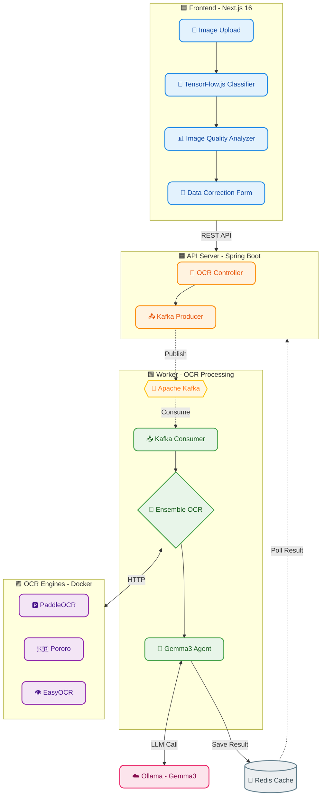

# 📄 Intelligent Document OCR & Classification System


> 📂 **GitHub 저장소**
> - **Frontend**: 현재 저장소 ([limjeahun/OCR](https://github.com/limjeahun/OCR))
> - **Backend**: [limjeahun/Merchant-Management-System](https://github.com/limjeahun/Merchant-Management-System)

---

## 📖 개요 (Overview)

**"단순한 텍스트 추출을 넘어, AI 기반 문서 인식과 지능형 데이터 파싱을 제공하다."**

본 시스템은 사업자등록증, 주민등록증, 운전면허증 등 **다양한 신분/사업 증명서를 자동으로 분류**하고, **앙상블 OCR 엔진**을 통해 텍스트를 추출한 후, **LLM(Gemma3)**을 활용하여 **구조화된 데이터로 변환**하는 End-to-End 솔루션입니다.

**핵심 차별점:**
- 🔍 **TensorFlow.js 기반 실시간 문서 분류** (브라우저 내 추론)
- 🎯 **3-Engine Ensemble OCR** (PaddleOCR + Pororo + EasyOCR)
- 🤖 **LLM 교차 검증** (Gemma3 프롬프트 엔지니어링)
- ⚡ **이벤트 기반 비동기 처리** (Kafka)

---

## 🏗️ 시스템 아키텍처 (Architecture)



### 1️⃣ Frontend (Next.js) - 문서 분류 및 품질 검사
- **TensorFlow.js Classifier**: MobileNet 기반 모델로 문서 유형을 실시간 분류 (ID_CARD, DRIVER_LICENSE, BUSINESS_REGISTRATION)
- **Image Quality Analyzer**: 해상도, 밝기, 대비 분석으로 OCR 성공률 사전 예측
- **Data Correction Form**: 추출된 데이터를 사용자가 검수/수정 후 저장

### 2️⃣ API Server - 요청 중계 및 이벤트 발행
- OCR 요청을 수신하고 Kafka로 이벤트 발행
- Redis에서 처리 결과 조회 (폴링 방식)

### 3️⃣ Worker Module - 핵심 OCR 처리
- **Ensemble OCR**: 3개 엔진을 병렬 실행하여 인식률 극대화
- **Gemma3 Agent**: LLM을 활용한 OCR 결과 교차 검증 및 필드 파싱

### 4️⃣ OCR Engines (Dockerized)
| Engine | 특징 | 역할 |
|--------|------|------|
| **PaddleOCR** | 중국어/한국어 강점, 빠른 속도 | 보조 참고용 |
| **Pororo** | 한국어 특화, 높은 정확도 | 우선 신뢰 |
| **EasyOCR** | 범용성, 안정성 | 우선 신뢰 |

---

## 💡 문제 정의 및 해결 (Case Study)

### 1️⃣ 문제: 단일 OCR 엔진의 낮은 인식률

**AS-IS**
- 한 가지 OCR 엔진만 사용하여 특정 이미지에서 인식 실패 빈번
- 흐릿한 글씨, 기울어진 문서 등에서 치명적인 오류 발생

**TO-BE**
- **앙상블 OCR 전략** 도입
- 3개 엔진을 병렬 실행하고, LLM이 결과를 교차 검증하여 최적의 값 선택
- 엔진별 강점(한글 인식, 숫자 정확도 등)을 상호 보완

### 2️⃣ 문제: 비문서 이미지의 잘못된 처리

**AS-IS**
- 만화, 사진 등 비문서 이미지가 문서로 분류되어 OCR 시도
- 불필요한 리소스 낭비 및 잘못된 결과 반환

**TO-BE**
- **Frontend 분류 + 신뢰도 임계값** (70%)
- **Backend 품질 검사** (성공 엔진 수, 한글 비율, 텍스트 길이 종합 평가)
- 품질 미달 시 `LOW_QUALITY` 상태 반환 및 사용자 안내

### 3️⃣ 문제: OCR 엔진 장애 시 전체 시스템 영향

**AS-IS**
- 동기 처리 구조로 OCR 엔진 1개가 장애나면 전체 요청 실패
- 처리 시간이 길어질수록 API 타임아웃 발생

**TO-BE**
- **이벤트 기반 아키텍처** (Kafka)
- API는 즉시 `requestId` 반환, Worker가 비동기 처리
- 개별 엔진 장애 시에도 다른 엔진 결과로 부분 성공 가능

---

## 💻 핵심 기능 (Key Features)

### 1. 실시간 문서 분류 (TensorFlow.js)
```
이미지 업로드 → MobileNet 추론 (브라우저 내) → 문서 유형 분류
  ↓ 신뢰도 < 70%
❌ "운전면허증, 주민등록증, 사업자 등록증 이미지만 가능합니다."
  ↓ 신뢰도 ≥ 70%
✅ OCR 진행
```

### 2. 이미지 품질 분석
| 항목 | 가중치 | 평가 기준 |
|------|--------|-----------|
| 해상도 | 40% | < 300K px → 저품질 |
| 밝기 | 30% | 0.2 ~ 0.85 범위 최적 |
| 대비 | 30% | 표준편차 기반 |

### 3. LLM 기반 필드 파싱 (Gemma3)
```kotlin
// 핵심 원칙
1. 엔진 우선순위: Pororo > EasyOCR > PaddleOCR
2. 형식 우선 선택: 각 필드마다 정해진 형식(예: XXX-XX-XXXXX)에 맞는 값을 선택
3. 우선순위가 높은 엔진의 값이 형식에 맞지 않으면, 형식에 맞는 다른 엔진의 값을 채택
```

### 4. 지원 문서 및 추출 필드

| 문서 유형 | 추출 필드 |
|-----------|-----------|
| **사업자등록증 (개인)** | 상호, 사업자번호, 대표자명, 주소, 업태, 종목, 개업일 |
| **사업자등록증 (법인)** | 상호, 사업자번호, 법인등록번호, 대표자명, 본점/사업장 소재지, 업태, 종목 |
| **주민등록증** | 성명, 주민등록번호(마스킹), 주소, 발급일 |
| **운전면허증** | 성명, 면허번호, 면허종류, 주소, 발급일, 암호일련번호 |

---

## 🛠️ 기술 스택 (Tech Stack)

### Frontend
| 기술 | 버전 | 용도 |
|------|------|------|
| Next.js | 16.0.10 | React 프레임워크 |
| TensorFlow.js | 4.22.0 | 브라우저 내 ML 추론 |
| OpenCV.js | - | 이미지 전처리 |
| TypeScript | 5.x | 타입 안정성 |

### Backend
| 기술 | 버전 | 용도 |
|------|------|------|
| Kotlin | 1.9.25 | 메인 언어 |
| Spring Boot | 3.5.8 | API 서버 |
| Spring Kafka | - | 이벤트 처리 |
| LangChain4j | - | LLM 통합 |

### Infrastructure
| 기술 | 용도 |
|------|------|
| Apache Kafka | 메시지 브로커 |
| Redis | 결과 캐싱 |
| Docker Compose | OCR 엔진 컨테이너화 |
| Ollama | Gemma3 LLM 서빙 |

### OCR Engines
| 엔진 | 포트 | 특징 |
|------|------|------|
| PaddleOCR | 9001 | PP-OCRv5 한국어 |
| Pororo | 9004 | KakaoBrain 한국어 특화 |
| EasyOCR | 9005 | 범용 OCR |

---

## 🚀 실행 방법 (Quick Start)

### 1. OCR 서비스 실행 (Docker)
```bash
cd docker
docker-compose up -d
```

### 2. Backend 서버 실행
```bash
./gradlew :api:bootRun
./gradlew :worker:bootRun
```

### 3. Frontend 실행
```bash
cd ../ocr
npm install
npm run dev
```

### 4. 브라우저 접속
```
http://localhost:3000
```

---

## 📁 프로젝트 구조

```
├── ocr/                          # Frontend (Next.js)
│   ├── src/
│   │   ├── components/           # React 컴포넌트
│   │   ├── services/             # API, OCR 서비스
│   │   └── app/                  # Next.js App Router
│   └── public/models/            # TensorFlow.js 모델
│
├── Merchant-Management-System/   # Backend (Kotlin)
│   ├── api/                      # REST API 모듈
│   ├── worker/                   # Kafka Consumer 모듈
│   ├── provider/                 # OCR 엔진 연동
│   ├── domain/                   # 도메인 엔티티
│   ├── common/                   # 공통 DTO
│   └── docker/                   # OCR Docker 설정
```
